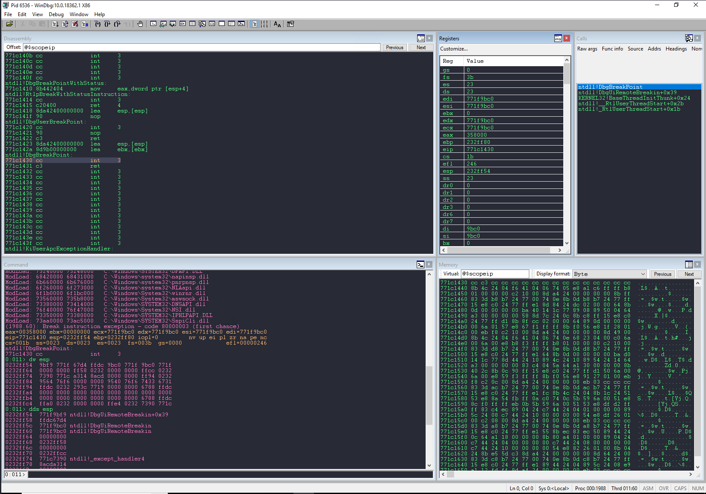

# windbg-assets
Custom assets for debugging Windows applications

## WinDbg

### Workspaces

[windbg_y0k4i.WEW](windbg_y0k4i.WEW) is a custom WinDbg Workspace created by me
inspired on [Dracula Theme](https://github.com/dracula/dracula-theme).

Preview:

### Extensions

  - [narly](https://code.google.com/archive/p/narly/)